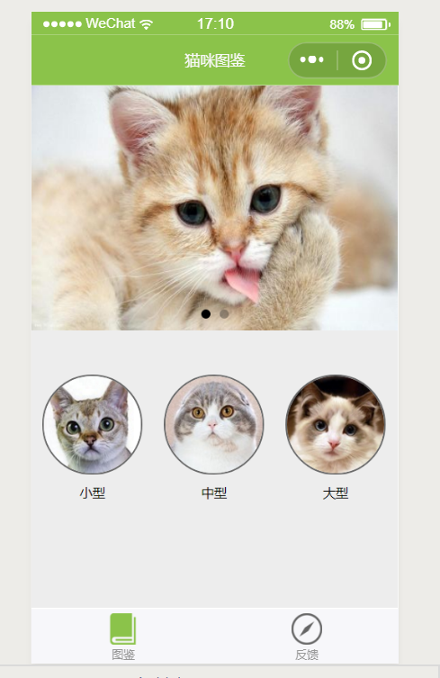
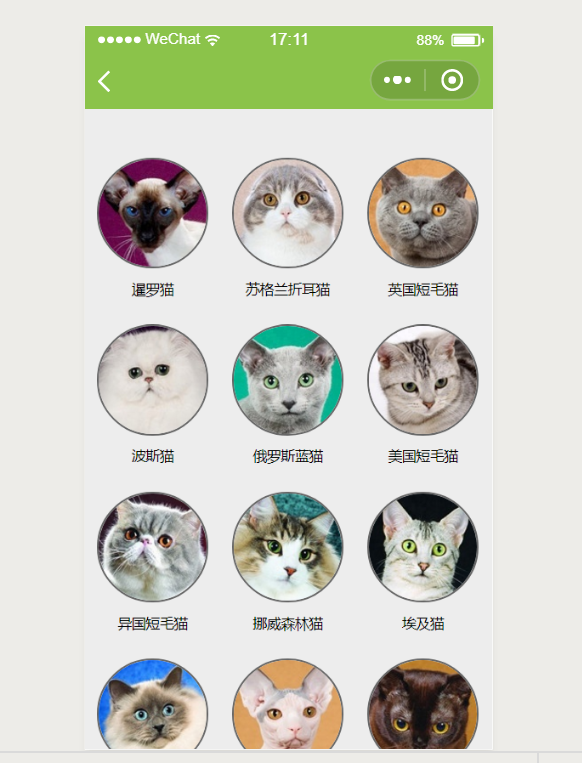
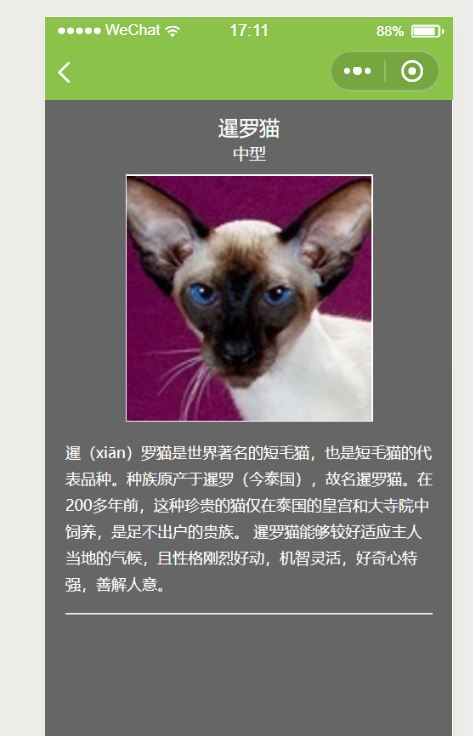

# 微信小程序-猫咪图鉴
# 猫咪图鉴功能概述
猫咪图鉴是一款采用美国CFA（国际爱猫联合会）标准对猫咪进行分类介绍。
# 编写背景
随着爱猫群体的逐渐壮大，人们去了解猫咪的需求越来越大，恰逢微信小程序盛行，因此编写猫咪图鉴此程序来使大家深入了解猫咪。
# 操作用例
##欢迎界面
用户点开小程序图标进入欢迎页面，利用如下代码，在js中进行编码使欢迎界面实现跳转功能，并在wxml中对显示内容进行设定，wxss中实现对样式的设定。

 
 ### 操作界面
 用户进入小程序之后在导航栏图鉴中看到大型、中型、小型三种猫咪分类，点开相应选项即可获得对应猫咪名称，选择想要了解猫咪头像便可以获得具体信息。
 
 
 
 ### 核心编码
 1.
 ```javascript
# js文件编码完成带参数值跳转，使得通过选项跳转至下一界面从而对应选项所在数据库中
Page({
  data: {
  },
  toSpecies:function(event){
    var fId = event.currentTarget.dataset.familyId;
    wx.navigateTo({         url: '../tujian-family/species/species?fId='+fId     
    })
  },
  
  onLoad: function (options) {
    this.setData({familyKey:faData.familys});     
  },

  onShareAppMessage: function (res) {
       
  }
})
```
2.
```javascript
# 在js中进行编码使欢迎界面实现跳转功能
Page({
  onTap:function(event){
    wx.switchTab({
      url: '../tujian-family/tujian-family'
    })
  }
}) 
```