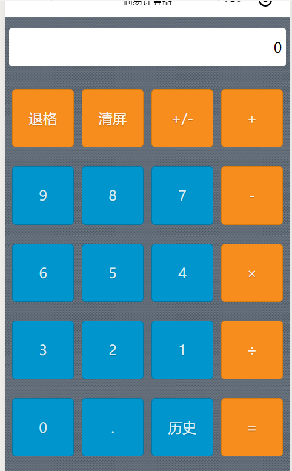
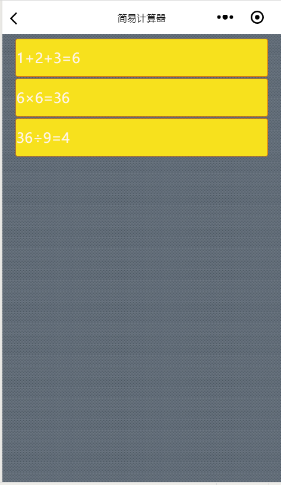

# # 微信小程序开发的简易计算器
## 1.页面设计
   在小程序中插入一张灰色背景图，将数字按键设置为蓝色，算符按键设置为橘色，显示框设置为白色，其按键页面设计的.wxml代码如下：
   ```
    <view  class="btnGroup">
    <view class="item orange" bindtap="clickButton" id="{{id1}}">退格</view>
    <view class="item orange" bindtap="clickButton"  id="{{id2}}">清屏</view>
    <view class="item orange" bindtap="clickButton"  id="{{id3}}">+/-</view>
    <view class="item orange" bindtap="clickButton"  id="{{id4}}">+</view>
  </view>

  <view  class="btnGroup">
    <view class="item blue" bindtap="clickButton"  id="{{id5}}">9</view>
    <view class="item blue" bindtap="clickButton"  id="{{id6}}">8</view>
    <view class="item blue" bindtap="clickButton"  id="{{id7}}">7</view>
    <view class="item orange" bindtap="clickButton"  id="{{id8}}">-</view>
  </view>

  <view  class="btnGroup">
    <view class="item blue" bindtap="clickButton"  id="{{id9}}">6</view>
    <view class="item blue" bindtap="clickButton"  id="{{id10}}">5</view>
    <view class="item blue" bindtap="clickButton"  id="{{id11}}">4</view>
    <view class="item orange" bindtap="clickButton"  id="{{id12}}">×</view>
  </view>
  
  <view  class="btnGroup">
    <view class="item blue" bindtap="clickButton"  id="{{id13}}">3</view>
    <view class="item blue" bindtap="clickButton"  id="{{id14}}">2</view>
    <view class="item blue" bindtap="clickButton"  id="{{id15}}">1</view>
    <view class="item orange" bindtap="clickButton"  id="{{id16}}">÷</view>
  </view>
  
  <view  class="btnGroup">
    <view class="item blue" bindtap="clickButton"  id="{{id17}}">0</view>
    <view class="item blue" bindtap="clickButton"  id="{{id18}}">.</view>
    <view class="item blue" bindtap="history"  id="{{id19}}">历史</view>
    <view class="item orange" bindtap="clickButton"  id="{{id20}}">=</view>
  </view>
```
  显示框及背景的页面设计的.wxss代码如下：
```
  .content{
    height: 100%;
    display: flex;
    flex-direction: column;
    align-items:center;
    box-sizing: border-box;
    background-image: url("data:image/png;base64,iVBORw0KGgoAAAANSUhEUgAAABgAAAAPCAYAAAD+pA/bAAAA/UlEQVQ4ja2RPRKCMBCFk1CL4kkAj2RvpY0Frd5RGbgAYDyA6y4hP0C02i1gvtmXzctbeTxdQWDtd6noX29hy7B2nCEPQT/bxvRrVk3zFHRDNzUNA7KeuB77vevX4kN6HejlgoN58lLdYbxJSDwI6HQzOvWcznlybtk5/cHKOqubB37BxVCjE6qQAfxLjP4Pt4aVzexQlCKssijmnM95qV9xblhxZ9600R1otswjO9CsmYcMOMDtgCvzyA54M/dskpHn6gacmRN3g9+p4sycioaHer8DhsxpqY7LYAecmZMe03EvU+RcoiKhqZPTFeM/EdI5XTJlq6yenON5y18PNJVeMb+1ywAAAABJRU5ErkJggg==");
    background-repeat: repeat;
    padding-top: 30rpx;}
    .screen{
    background-color:#FFFFFF;
    border-radius: 3px;
    text-align: right;
    width:720rpx;
    height:100rpx;
    line-height: 100rpx;
    padding-right: 10rpx;
    margin-bottom:  50rpx;
}
.btnGroup{
    display:flex;
    flex-direction:row;
}
.item{
    width:160rpx;
    min-height:150rpx;
    margin: 10rpx;
    text-shadow: 0 1px 1px rgba(0,0,0,.3);
    border-radius: 5px;
    text-align: center;
    line-height: 150rpx;
    margin-top: 10rpx;
    margin-bottom: 40rpx;
   }
.orange{
    color: #fef4e9;
    border: solid 1px #da7c0c;
    background: #f78d1d;
}
.blue{
    color: #d9eef7;
    border: solid 1px #0076a3;
    background: #0095cd;
 }
```  
显示效果如图
    
    


    
## 2.逻辑算法
```
Page({
  data:{
    // text:"这是一个页面"
     id1:"back",
     id2:"clear",
     id3:"negative",
     id4:"+",
     id5:"9",
     id6:"8",
     id7:"7",
     id8:"-",
     id9:"6",
     id10:"5",
     id11:"4",
     id12:"×",
     id13:"3",
     id14:"2",
     id15:"1",
     id16:"÷",
     id17:"0",
     id18:".",
     id19:"history",
     id20:"=",
     screenData:"0",
     lastIsOperator:false,
     arr:[],
     logs:[]
  },
  onLoad:function(options){
    // 页面初始化 options为页面跳转所带来的参数
  },
  onReady:function(){
    // 页面渲染完成
  },
  onShow:function(){
    // 页面显示
  },
  onHide:function(){
    // 页面隐藏
  },
  onUnload:function(){
    // 页面关闭
  },
  history:function(){
      wx.navigateTo({
      url: '../list/list'
    })
  },
  clickButton:function(event){
      console.log(event.target.id);
    var id=event.target.id;
    if(id==this.data.id1){//退格
           var data = this.data.screenData;
           data=data.substring(0,data.length-1); 
           if(data==""||data=="-"||data=="0"){
               data=0;
           }
           this.setData({screenData:data});
           this.data.arr.pop();
      }else if(id==this.data.id2){//清屏
         this.setData({screenData:"0"});
         this.data.arr.length=0;
      }else if(id==this.data.id3){//正负号
          var data = this.data.screenData;
          if(data==0){
              return;
          }
          var firstWord=data.substring(0,1);
          if(firstWord=="-"){
              data=data.substring(1,data.length);
              this.data.arr.shift();
          }else{
              data="-"+data;
              this.data.arr.unshift("-");
          }
         this.setData({screenData:data});   
      }else if(id==this.data.id20){// =
         var data = this.data.screenData;
         if(data==0){
               return;
         }
         var lastWord = data.substring(data.length-1,data.length);
         if(isNaN(lastWord)){
             return;
         }
         var num="";      
         var lastOperator;
         var arr = this.data.arr;
         var optarr=[];
         for(var i in arr){
             if(isNaN(arr[i])==false||arr[i]==this.data.id18||arr[i]==this.data.id3){
                 num+=arr[i];
             }else{
               lastOperator= arr[i];
               optarr.push(num);
               optarr.push(arr[i]);
               num="";
             }
         }
         optarr.push(Number(num));
         var result=Number(optarr[0])*1.0;
          console.log(result)
         for(var i=1;i<optarr.length;i++){
             if(isNaN(optarr[i])){
                if(optarr[1]==this.data.id4){
                    result+=Number(optarr[i+1]);
                }else if(optarr[1]==this.data.id8){
                    result-=Number(optarr[i+1]);
                }else if(optarr[1]==this.data.id12){
                    result*=Number(optarr[i+1]);
                }else if(optarr[1]==this.data.id16){
                    result/=Number(optarr[i+1]);
                }
             }
         }        
         this.data.logs.push(data+"="+result);
         wx.setStorageSync('callogs', this.data.logs);
         this.data.arr.length=0;
         this.data.arr.push(result);
         this.setData({screenData:result+""});
      }else{
       if(id==this.data.id4||id==this.data.id8||id==this.data.id12||id==this.data.id16){
         if(this.data.lastIsOperator==true||this.data.screenData==0){
             return;
         }       
        }
        var sd=this.data.screenData;
        var data;
        if(sd==0){
            data=id;
        }else{
            data=sd+id;
        }
        this.setData({screenData:data});
        this.data.arr.push(id);

        if(id==this.data.id4||id==this.data.id8||id==this.data.id12||id==this.data.id16){
            this.setData({lastIsOperator:true});
        }else{
            this.setData({lastIsOperator:false});
        }
      }
  }
})
```
## 3.页面跳转设计
```
<view class="content">
  <block wx:for="{{logs}}" wx:for-item="log">
     <view class="item"> {{log}}</view>
  < /block>
</view>
```
效果如图：

